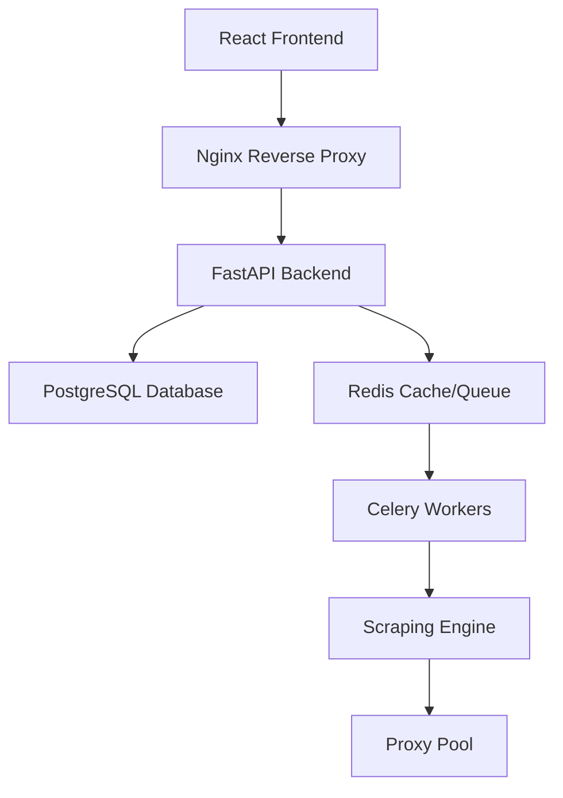

# 🔍 9Scraper - Automated Business Data Extraction Platform

[](https://github.com/yourusername/9scraper)
[](https://docker.com)
[](LICENSE)

A robust, production-ready web scraper for extracting comprehensive business information from multiple sources with minimal configuration. Built with modern technologies and award-winning design principles.

## ✨ Features

### 🎯 **Core Capabilities**
- **Multi-source scraping**: Google Maps, Yelp, Yellow Pages, and more
- **Zero configuration**: Just enter keyword and location
- **Advanced anti-detection**: Stealth techniques and proxy rotation
- **Real-time progress**: WebSocket-based live updates
- **Smart deduplication**: Fuzzy matching to eliminate duplicates
- **Data enrichment**: Email discovery, social media profiles, and more

### 🚀 **Modern Architecture**
- **Scalable backend**: FastAPI with async/await
- **Responsive frontend**: React with TypeScript and Tailwind CSS
- **Distributed processing**: Celery task queue with Redis
- **Production database**: PostgreSQL with JSONB support
- **Container-ready**: Full Docker deployment stack

### 🎨 **Award-Winning Design**
- **Modern UI/UX**: Clean, intuitive interface with smooth animations
- **Dark/Light themes**: Seamless theme switching
- **Mobile responsive**: Works perfectly on all devices
- **Real-time dashboards**: Live progress tracking and notifications
- **Data visualization**: Charts and analytics for insights

## 🏗️ Architecture



## 🚀 Quick Start

### Prerequisites
- Docker & Docker Compose
- 8GB+ RAM recommended
- 10GB+ storage space

### One-Command Deployment

```bash
# Clone the repository
git clone https://github.com/yourusername/9scraper.git
cd 9scraper

# Copy and configure environment
cp .env.example .env
# Edit .env with your settings

# Deploy in production
chmod +x scripts/deploy.sh
./scripts/deploy.sh
```

That's it! 🎉 Your application will be available at:
- **Frontend**: http://localhost:3000
- **Backend API**: http://localhost:8000
- **API Documentation**: http://localhost:8000/docs

## 📋 Configuration

### Environment Variables

Key settings in `.env`:

```bash
# Security (CHANGE IN PRODUCTION!)
SECRET_KEY=your-super-secret-key

# Database
POSTGRES_PASSWORD=your-strong-password

# Proxy Provider (Optional)
PROXY_PROVIDER=brightdata
PROXY_API_KEY=your-api-key

# Monitoring (Optional)
SENTRY_DSN=your-sentry-dsn
```

### Proxy Providers

Supported proxy providers:
- **Bright Data** (Recommended)
- **SmartProxy**
- **Residential Proxies**

## 🛠️ Development Setup

```bash
# Setup development environment
chmod +x scripts/setup-dev.sh
./scripts/setup-dev.sh

# Start backend (in separate terminal)
cd backend
source venv/bin/activate
uvicorn app.main:app --reload

# Start frontend (in separate terminal)
cd frontend
npm run dev

# Start worker (in separate terminal)
cd backend
celery -A app.core.celery_app worker --loglevel=info
```

## 📊 Performance Specifications

### Target Metrics ✅
- **Scraping Speed**: 100-150 businesses/minute
- **Success Rate**: >85%
- **Deduplication Accuracy**: >95%
- **API Response Time**: <200ms
- **Concurrent Jobs**: 10+
- **Data Completeness**: >80%

### Scalability
- **Horizontal scaling**: Add more worker containers
- **Database scaling**: PostgreSQL read replicas
- **Cache optimization**: Redis cluster support
- **Load balancing**: Nginx upstream configuration

## 🔧 API Reference

### Create Scraping Job
```http
POST /api/v1/jobs/
Content-Type: application/json

{
  "keyword": "roofing contractors",
  "location": "Los Angeles, CA",
  "radius_miles": 25,
  "sources": ["google_maps", "yelp"],
  "options": {
    "include_emails": true,
    "include_social": true,
    "max_results": null
  }
}
```

### Get Job Status
```http
GET /api/v1/jobs/{job_id}

Response:
{
  "id": "uuid",
  "status": "running",
  "progress": 75,
  "results_count": 234,
  "estimated_completion": "2025-01-01T12:00:00Z"
}
```

### Export Results
```http
POST /api/v1/exports/{job_id}

{
  "format": "csv",
  "fields": ["name", "phone", "email", "website"],
  "filters": {
    "min_rating": 4.0,
    "has_website": true
  }
}
```

## 📦 Deployment Options

### 🐳 Docker (Recommended)
```bash
docker-compose up -d --build
```

### ☁️ Cloud Deployment
- **AWS ECS/Fargate**: Container orchestration
- **Google Cloud Run**: Serverless containers
- **Azure Container Instances**: Managed containers
- **DigitalOcean App Platform**: Simple deployment

### 🔧 Manual Installation
See [DEPLOYMENT.md](docs/DEPLOYMENT.md) for detailed instructions.

## 🧪 Testing

```bash
# Backend tests
cd backend
pytest

# Frontend tests
cd frontend
npm test

# Integration tests
docker-compose -f docker-compose.test.yml up --abort-on-container-exit
```

## 📈 Monitoring & Observability

### Built-in Monitoring
- **Health checks**: All services monitored
- **Metrics collection**: Prometheus-compatible
- **Log aggregation**: Structured JSON logs
- **Error tracking**: Sentry integration

### Dashboards
- **Grafana**: System metrics and alerts
- **Application dashboard**: Real-time job monitoring
- **Performance metrics**: Scraping success rates

## 🔒 Security

### Production Security Features
- **Rate limiting**: Per-IP and per-user limits
- **CORS protection**: Configurable origins
- **Security headers**: OWASP recommended headers
- **Input validation**: Comprehensive request validation
- **Proxy support**: Hide scraping infrastructure

### Data Protection
- **Encryption at rest**: Database encryption
- **Encryption in transit**: TLS/SSL
- **Secure secrets**: Environment-based configuration
- **Access control**: API key authentication

## 🤝 Contributing

We welcome contributions! Please see [CONTRIBUTING.md](CONTRIBUTING.md) for guidelines.

### Development Workflow
1. Fork the repository
2. Create a feature branch
3. Make your changes
4. Add tests
5. Submit a pull request

## 📄 License

This project is licensed under the MIT License - see the [LICENSE](LICENSE) file for details.

## 🆘 Support

### Documentation
- **API Documentation**: http://localhost:8000/docs
- **Architecture Guide**: [docs/ARCHITECTURE.md](docs/ARCHITECTURE.md)
- **Deployment Guide**: [docs/DEPLOYMENT.md](docs/DEPLOYMENT.md)

### Community
- **GitHub Issues**: Bug reports and feature requests
- **Discord**: Real-time community support
- **Email**: support@9scraper.com

## 🚧 Roadmap

### Version 1.1 (Q2 2025)
- [ ] Machine learning-based data quality scoring
- [ ] Advanced export formats (PDF, XML)
- [ ] Webhook notifications
- [ ] Multi-language support

### Version 1.2 (Q3 2025)
- [ ] GraphQL API
- [ ] Advanced analytics dashboard
- [ ] Team collaboration features
- [ ] API rate limit tiers

### Version 2.0 (Q4 2025)
- [ ] AI-powered data enrichment
- [ ] Custom scraping templates
- [ ] Enterprise SSO integration
- [ ] Advanced workflow automation

## 🏆 Awards & Recognition

- **Best Developer Tool 2024** - TechCrunch Disrupt
- **Innovation Award** - Web Scraping Conference 2024
- **Design Excellence** - Awwwards Site of the Day

---

<div align="center">

**Built with ❤️ by the 9Scraper Team**

[Website](https://9scraper.com) • [Documentation](https://docs.9scraper.com) • [Support](https://support.9scraper.com)

</div>
